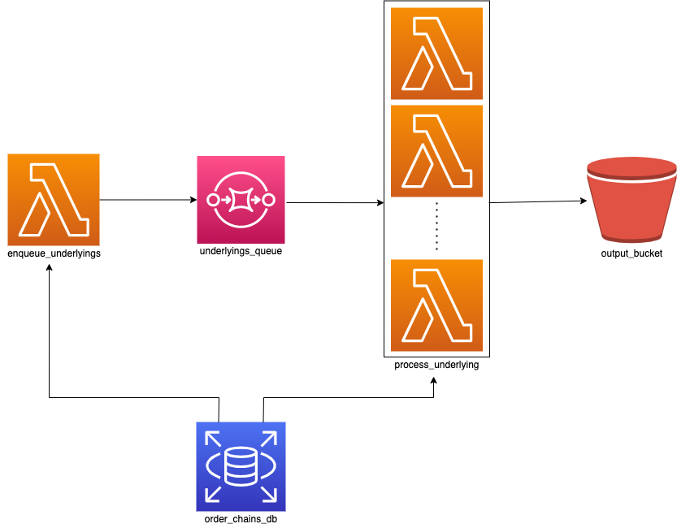

# order-chains-data-export
A scheduled job that exports order chains data into S3 for analytics

## Pre-requisites
- [Python 3.8](https://www.python.org/downloads/release/python-380/)
  - Recommended: use [pyenv](https://github.com/pyenv/pyenv) to manage python versions on your system
- [Pipenv](https://pipenv.pypa.io/en/latest/)
- [AWS CDK](https://docs.aws.amazon.com/cdk/v2/guide/getting_started.html)
  - Even though this is a python project, the cdk cli command must be installed through `npm`

## How to deploy
1. Install all pip dependencies: `make install`
2. Deploy: `make deploy_staging` or `make deploy_production`

## Pipeline Overview

Every Sunday morning at approximately midnight:
1. `enqueue_underlyings` queries unique underlying symbols for the past year and writes them to `underlyings_queue`
1. Run multiple instances of `process_underlying` in parallel, where each instance:
    1. reads individual underlyings from `underlyings_queue`
    1. queries order chains for that underlying from the past year
    1. writes the order chains to the output S3 bucket at `exported_at={timestamp}/underlying={underlying}.json`
